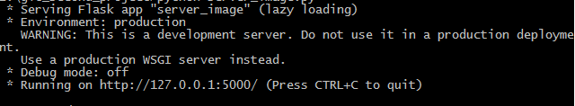

## 图片加水印

###下载

在命令窗口(Windows 使用 win+R 调出 cmd 运行框)使用以下命令，下载

    C:\Users\Administrator>cd e:
	E:>git clone https://github.com/xyz06/image_add_watermark.git
下载完成就会有image_add_watermark文件夹	
    

##
###运行

进入image_add_watermark文件夹，运行server_image.py文件启动服务

    E:>cd image_add_watermark
    E:\image_add_watermark>python server_image.py

出现以下内容表示启动成功

##
###使用

浏览器输入[http://127.0.0.1:5000/](http://127.0.0.1:5000),显示主页

当没有上传图片或文字，就会跳转到提示错误页

点击提交后，就会展示水印后的图片

